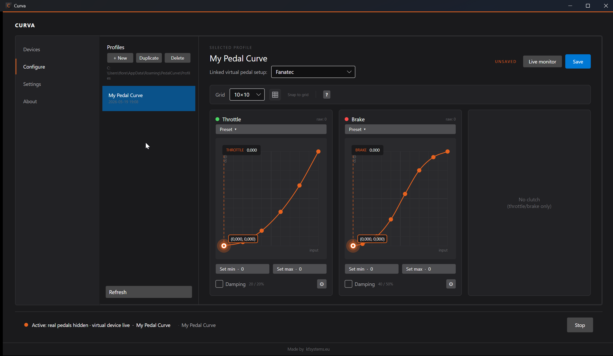

# Curva

A small Windows app that puts a response curve and adaptive damping on each of your sim racing pedals.

[Download the latest release](https://github.com/FloreKoen/curva/releases/latest)

## What it does

You shape each pedal with its own curve. Throttle, brake, clutch. You can also damp out the sensor jitter so the car stops twitching when your foot is off.

Curva reads your real pedals over HID, runs them through your curves, and writes the result into a virtual joystick that games see as normal hardware. While Curva is on, your real pedals are hidden from games, so there is no double input.

## The curve editor

Drag control points around the graph. Input is on the X axis, output on the Y. Each segment between two points is either:

- Linear: a straight line.
- Smooth: a curve that cannot dip below or rise above the points you set.

You can mix linear and smooth segments in the same curve.

## Damping

Each pedal has its own damping with a strength from 0 to 100% per direction. It runs on the raw input, before the curve, so a steep curve cannot turn small sensor noise into big output noise.

## Activation

Curva is either off or on. Off means your real pedals work like normal. On means your real pedals are hidden and the virtual joystick is live with your curves. One button at the bottom switches between them. Ctrl+Space does the same thing.

There is an orange stripe at the top of the window when Curva is on, so you always know which mode you are in.

If anything crashes while Curva is on, the next launch offers to put your real pedals back. There is also a restore.bat in the install folder.

## Profiles

You can save multiple profiles per pedal device and switch between them with a click. Profiles are JSON files in `%APPDATA%\Curva\`, so backing them up is just copying that folder.

## Install

Download the installer from the release page and run it.

The installer checks whether the two drivers Curva needs are already on your machine, and only installs the ones that are missing:

- HidHide by Nefarius Software Solutions. Hides your real pedal device from games while Curva is on.
- vJoy Revived by njz3. Exposes the curved output as a virtual joystick.

Both are open source. Curva does not bundle them as redistributables. It chains the installers from the upstream projects.

## Requirements

Windows 10 21H2 or later, 64-bit. A USB pedal set that shows up as a standard HID device.

## Quick start

1. Run the installer. Accept the driver installs if prompted.
2. Open Curva.
3. On the Devices tab, pick your pedals and run the setup wizard so Curva learns which axis is which.
4. Switch to the Configure tab and shape the curves. Right-click a segment to toggle it between Linear and Smooth.
5. Hit Start at the bottom.
6. Map the virtual joystick axes in your game. They show up as "vJoy Device" on the standard joystick screen.

## Privacy

No network requests. Profiles and settings live in `%APPDATA%\Curva\`.

## Source

Source code lives in a separate private repository. Builds here are produced from it.

## Made by

[kfsystems.eu](https://kfsystems.eu/)
